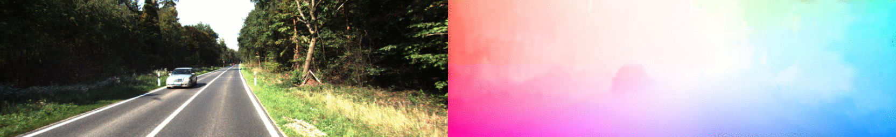

# UnOpticalFlow
This repository contains the source code and pretrained models from the paper **Occlusion Aware Unsupervised Learning of Optical Flow From Video**.
[paper link](https://arxiv.org/pdf/2003.01960)


## Dependencies
Python3 and pytorch are required. Third party libraries can be installed using:
```
pip3 install -r requirements.txt
```

## Preparing training data
### kitti
First download the kitti raw data and then run the following command.
```
python3 data/prepare_train_data.py /path/to/raw/kitti/dataset/ --dataset-format 'kitti' --dump-root /path/to/resulting/formatted/data/ --width 832 --height 256 --num-threads 1 --static-frames data/static_frames.txt
```

## Traning
Once the data are formatted following the above instructions, you should be able to run a training experiment. 
```
python3 train.py /path/to/resulting/formatted/data/ --flownet Back2FutureS -f 100 -b 16 -pf1st 0.06 -pf2nd 8.0 -s1st 0.0 -s2nd 10 -a 10 -cv 0.0 --wssim 0.0 --wconsis 0.0 --epoch-size 1000 --log-output --lr 2e-4 --with-flow-gt --kitti-dir /path/to/validation_data/kitti2015 --epochs 400 --smoothness-type edgeaware --log-terminal --min --name experiment_name

```
experiment you run gets logged in experiment_recorder.md.
You can then start a tensorboard session in this folder by
```
tensorboard --logdir=checkpoints/
```

## Testing
You can download the pretrained models for testing from [here](https://drive.google.com/open?id=1AL1sbANhqQvnMt8kAsGB9jyyKgxbhvDj).
Optical Flow evaluation using:
```
python test_flow_back2future.py --flownet Back2FutureS  --pretrained-flow /path/to/flownet/flownet_model_best.pth.tar  --kitti-dir 'path/to/kitti2015' -all -kdt Kitti2015
```

## Acknowlegements
We are grateful to Anurag Ranjan for his [github repository](https://github.com/anuragranj/cc#competitive-collaboration). We use it as our initial code base.
